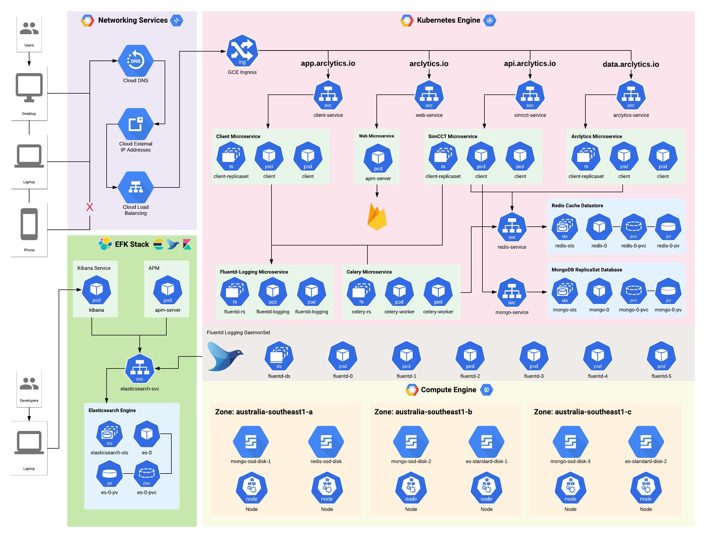
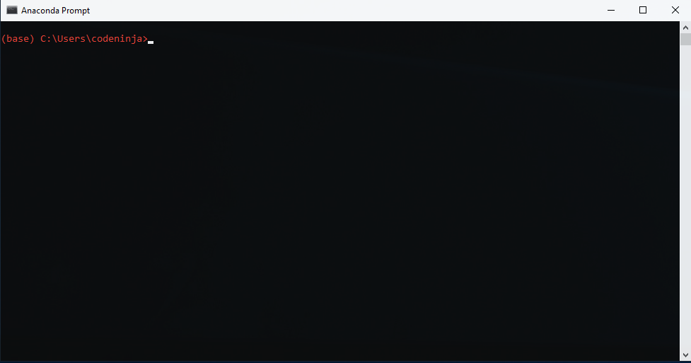
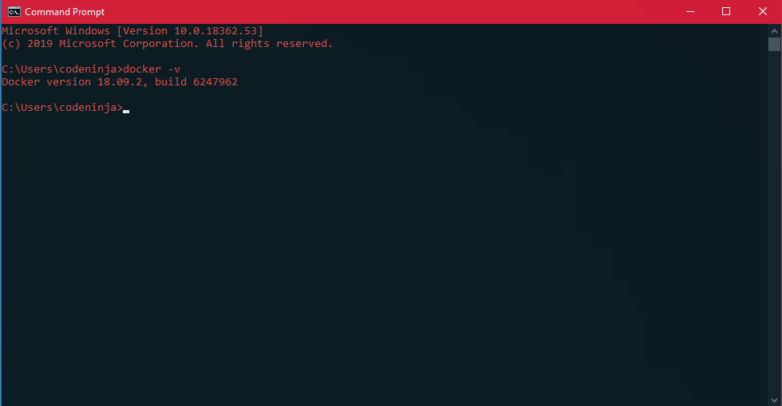
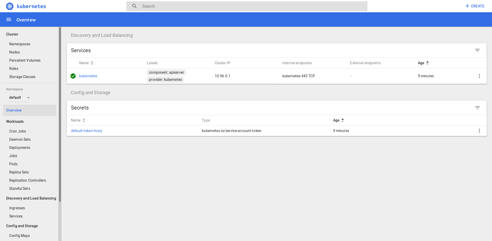

# Arclytics SimCCT

This is the CSIT321 Arclytics SimCCT source code repository.

Arclytics Sim (pronounced *ark-lit-icks*) is a project in collaboration with the Australian Nuclear Science and Technology Organisation (ANSTO) to provide a Phase Transformation scientific web application tool.

Arclytics SimCCT is built using a Microservices Client-Server Architecture. To manage our application during the development phase, we use Docker containers to maintain our microservices. During deployment, we use Kubernetes as our preferred container orchestration tool. 

Using a microservices architecture has allowed our team to take advantages of modern-day web development, including:

* Smaller code bases
* Separation of Concerns with Modularity
* Interoperability
* Portability 
* Reproducibility
* Scalability

Our application architecture can be described by the following:




[**Play with the tool »**](https://app.arclytics.io)  

[Website](https://arclytics.io) · [LICENSE](https://bitbucket.org/neuraldev/arclytics_sim/src/master/LICENSE)


## Table of contents

* [Getting started](#Getting Started)
  * [Prerequisites](#Prerequisites)
    * [Installing Anaconda](#Installing Anaconda)
    * [Installing Docker](#Installing Docker)
    * [Docker and Docker Compose (Short) Cheatsheet](#Docker and Docker Compose (Short) Cheatsheet)
* [Tests and Examples](#Tests and Examples)
* [Deployment](#Deployment)
* [Versioning](#Versioning)
* [License](#License)
* [Authors](#Authors)
* [Acknowledgements](#Acknowledgements)


## Getting Started

These instructions will get you a copy of the project up and running on your local machine for development and testing purposes. See deployment for notes on how to deploy the project on a live system.


### Prerequisites

Under the hood, Arclytics Sim uses the Docker containers as we develop with a microservices architecture. The infrastructure is built using Container as a Service (CaaS) with `docker-compose`. To ensure you can run the application in development, you will need to install the dependencies with the versions listed below. 

Arclytics Sim will use the following technologies and tools:

* [Anaconda](https://www.anaconda.com/)
* [Docker](https://www.docker.com/)
* [Docker-Compose](https://docs.docker.com/compose/overview/)
* [Docker-Machine](https://docs.docker.com/machine/overview/)
* [Kubernetes](https://kubernetes.io/docs/home/)
* [Dask](https://dask.org/)
* [Flask](http://flask.pocoo.org/)
* [NodeJS](https://nodejs.org/en/)
* [npm](https://www.npmjs.com/)
* [React](https://reactjs.org/)
* [Plotly](https://plot.ly/)
* [Redis](https://redis.io/)
* [MongoDB](https://www.mongodb.com/)
* [Swagger](https://swagger.io/docs/)

To ensure this application in development works properly, you will need the following dependency versions as a minimum:

```
conda >= 4.7.11
docker >= 19.03.1
docker-compose >= 1.24.1
nodejs >= 10.16.2
```


#### Installing Anaconda

- **Windows**/**macOS**: download the installer for Anaconda [here](https://www.anaconda.com/distribution/#download-section).
- **Linux** (Ubuntu 16.04/18.04): follow [this tutorial](https://www.digitalocean.com/community/tutorials/how-to-install-anaconda-on-ubuntu-18-04-quickstart) by DigitalOcean to install Anaconda.

Once installed, if you are using Linux/macOS, open the terminal to create a virtual environment. If you are using Windows, you can open the Anaconda Prompt.



#### Installing Docker

To get the containers running, install Docker from [here](https://www.docker.com/get-started). From here, select **Download for Windows** or **Download for Mac**. It will ask you to login or create an account before you can download. Once you have create an account, please select **Get Docker Desktop for Windows (stable)**. During installation, **DO NOT** select the option for Windows containers.

If you're using **Linux** (Ubuntu/Cent OS), you can also follow [this tutorial](https://www.digitalocean.com/community/tutorials/how-to-install-and-use-docker-on-ubuntu-18-04) for Ubuntu 18.04 and this [one](https://medium.com/@Grigorkh/how-to-install-docker-on-ubuntu-19-04-7ccfeda5935) for 19.04 to install Docker from the terminal. To find out which version you are on, use `lsb_release -rs` if you are using Ubuntu. 

Optionally, you can download and use the Docker GUI by downloading Kitematic from [here](https://docs.docker.com/toolbox/toolbox_install_windows/) for Windows.




#### Docker and Docker Compose (Short) Cheatsheet

Some handy Docker commands:

**Building the containers only**

```powershell
> docker-compose build
```

* Additionally, you can add the name of the service from `docker-compose.yml` to build only those services (i.e. `docker-compose build client` will only build the `client` server).

**Starting and building the containers**

```powershell
> docker-compose up -d --build
```
* `-d` (optional): run the containers in detached mode without `stdout` and `stderr` to the terminal.
* `--build` (optional): will build the images from the `Dockerfile` or rebuild from the Docker cache.

**Starting some specific containers**

```powershell
> docker-compose up -d --build client users simcct
```

* `client users simcct`: will only run the containers with these service names as defined in `docker-compose.yml`. 
* Note: Because `users` and `simcct` have a list of other services set as `depends_on` in `docker-compose.yml` you will find those additional services will also be run (i.e. the `users` service requires `mongodb` so it will also be run even without explicit commands telling it to run).

**Stopping the containers**

```powershell
> docker-compose down
```

**Listing all running containers**

```powershell
> docker ps -a

CONTAINER ID        IMAGE                        COMMAND                  CREATED              STATUS              PORTS                                      NAMES
deba49685ca4        arc_sim_client:1.0           "docker-entrypoint.s…"   About a minute ago   Up About a minute   0.0.0.0:3000->3000/tcp                     arc-client
30d29a1eeee9        arc_sim_users_service:1.0    "/docker-entrypoint.…"   About a minute ago   Up About a minute   0.0.0.0:8000->8000/tcp                     arc-users
c34f86790ad8        arc_simcct_service:1.0       "/docker-entrypoint.…"   About an hour ago    Up About an hour    0.0.0.0:8001->8001/tcp                     arc-simcct
b9e0c572a505        arc_sim_swagger:1.0          "sh /usr/share/nginx…"   3 days ago           Up 8 hours          80/tcp, 3001/tcp, 0.0.0.0:3001->8080/tcp   swagger-ui
ae1cc5ab4e68        arc_sim_mongo:1.0            "docker-entrypoint.s…"   5 days ago           Up 11 hours         0.0.0.0:27017->27017/tcp                   arc-mongo
dab8694ce845        arc_sim_redis:1.0            "docker-entrypoint.s…"   5 days ago           Up 11 hours         0.0.0.0:6379->6379/tcp                     arc-redis
```

**Listing all containers**

```powershell
> docker container ls -a

CONTAINER ID        IMAGE                        COMMAND                  CREATED              STATUS              PORTS                                      NAMES
deba49685ca4        arc_sim_client:1.0           "docker-entrypoint.s…"   About a minute ago   Up About a minute   0.0.0.0:3000->3000/tcp                     arc-client
30d29a1eeee9        arc_sim_users_service:1.0    "/docker-entrypoint.…"   About a minute ago   Up About a minute   0.0.0.0:8000->8000/tcp                     arc-users
c34f86790ad8        arc_simcct_service:1.0       "/docker-entrypoint.…"   About an hour ago    Up About an hour    0.0.0.0:8001->8001/tcp                     arc-simcct
b9e0c572a505        arc_sim_swagger:1.0          "sh /usr/share/nginx…"   3 days ago           Up 8 hours          80/tcp, 3001/tcp, 0.0.0.0:3001->8080/tcp   swagger-ui
ae1cc5ab4e68        arc_sim_mongo:1.0            "docker-entrypoint.s…"   5 days ago           Up 11 hours         0.0.0.0:27017->27017/tcp                   arc-mongo
dab8694ce845        arc_sim_redis:1.0            "docker-entrypoint.s…"   5 days ago           Up 11 hours         0.0.0.0:6379->6379/tcp                     arc-redis
```

**Deleting a container**

```powershell
> docker stop arc-users

arc-users

> docker container ls -a

CONTAINER ID        IMAGE                        COMMAND                  CREATED             STATUS                        PORTS                                      NAMES
deba49685ca4        arc_sim_client:1.0           "docker-entrypoint.s…"   2 minutes ago       Up 2 minutes                  0.0.0.0:3000->3000/tcp                     arc-client
30d29a1eeee9        arc_sim_users_service:1.0    "/docker-entrypoint.…"   2 minutes ago       Exited (137) 20 seconds ago                                              arc-users
c34f86790ad8        arc_simcct_service:1.0       "/docker-entrypoint.…"   About an hour ago   Up About an hour              0.0.0.0:8001->8001/tcp                     arc-simcct
b9e0c572a505        arc_sim_swagger:1.0          "sh /usr/share/nginx…"   3 days ago          Up 8 hours                    80/tcp, 3001/tcp, 0.0.0.0:3001->8080/tcp   swagger-ui
ae1cc5ab4e68        arc_sim_mongo:1.0            "docker-entrypoint.s…"   5 days ago          Up 11 hours                   0.0.0.0:27017->27017/tcp                   arc-mongo
dab8694ce845        arc_sim_redis:1.0            "docker-entrypoint.s…"   5 days ago          Up 11 hours                   0.0.0.0:6379->6379/tcp                     arc-redis

> docker rm arc-users
arc-users
```

**Listing images**

```powershell
> docker image ls

REPOSITORY               TAG                 IMAGE ID            CREATED             SIZE
arc_sim_swagger          1.0                 a947b052fd96        2 minutes ago       51.9MB
arc_sim_client           1.0                 9d7dc017c538        2 minutes ago       895MB
arc_sim_users_service    1.0                 379664ae171b        3 minutes ago       437MB
arc_sim_mongo            1.0                 bba28f4d4781        4 minutes ago       413MB
arc_simcct_service       1.0                 fb648c779cd3        5 minutes ago       618MB
arc_sim_redis            1.0                 e2e646c03358        7 minutes ago       98.2MB
redis                    5.0.5               f7302e4ab3a8        3 days ago          98.2MB
node                     10.16.2-alpine      4f877c96a193        8 days ago          76.4MB
mongo                    4.0.11              f7adfc4dbcf5        2 weeks ago         413MB
python                   3.7.3-alpine        2caaa0e9feab        7 weeks ago         87.2MB
nginx                    1.15-alpine         dd025cdfe837        3 months ago        16.1MB
continuumio/miniconda3   4.6.14              6b5cf97566c3        3 months ago        457MB
```

**Deleting an image**

```powershell
> docker image ls

REPOSITORY               TAG                 IMAGE ID            CREATED              SIZE
arc_sim_users_service    1.0                 0f4bcade4bb2        36 seconds ago       437MB
arc_sim_redis            1.0                 bd601c214682        About a minute ago   98.2MB
arc_simcct_service       1.0                 e3e25a676e12        About an hour ago    618MB
redis                    5.0.5               f7302e4ab3a8        3 days ago           98.2MB
arc_sim_swagger          1.0                 aa9244f9f297        4 days ago           51.9MB
arc_sim_client           1.0                 c6d1f45bc149        4 days ago           895MB
arc_sim_mongo            1.0                 d24defd62cde        5 days ago           413MB
<none>                   <none>              c13142733b7c        5 days ago           98.2MB
node                     10.16.2-alpine      4f877c96a193        8 days ago           76.4MB
mongo                    4.0.11              f7adfc4dbcf5        2 weeks ago          413MB
python                   3.7.3-alpine        2caaa0e9feab        7 weeks ago          87.2MB
nginx                    1.15-alpine         dd025cdfe837        3 months ago         16.1MB
continuumio/miniconda3   4.6.14              6b5cf97566c3        3 months ago         457MB

> docker rmi arc_sim_client:1.0

Untagged: arc_sim_client:1.0
Deleted: sha256:c6d1f45bc149b8db2770eba21777c959b5bfc921c3a3991f9c0f623c9159af43
Deleted: sha256:9ad449dad936d6d1fb85e0aad3336d74e69d1cdde564b1636d2b7f17eb2c85ce
Deleted: sha256:49136c36390f8f6e4bd90e9985242bb6cb36e206e2b259431ab6923ce51d714f
Deleted: sha256:4db8f1460fb3290ed3e34dc42cc7c8a0de209b7c18a0c990cd5e4467eafa4e0c
Deleted: sha256:b51ca30788fcbc359def2f103f5bb2f8839425185dfb95b776f1c7b6476baa8d
Deleted: sha256:50f6ac821285606cb49c2428b3e4ca8f0d9e89328962e7b59e38bb2a829bfdba
Deleted: sha256:8fc65493a9f6fbf180bd6a5a47cfbc93055d1cb42ab7c4a4fdb71a21087deb0a
Deleted: sha256:5766a395bbe0412c8ffb8ff4e24c00794ea9b07c76f43657e0912dd0ec8f33bf
Deleted: sha256:958bb1f5842f6330ad2ea8eeb633503876eecd478a89f8148a3fa33e70e70bf6
Deleted: sha256:3d36c828a9be725296e18896e481ffad5ce8f484b6ff5e89dce263d417e66e1c
Deleted: sha256:6a4aa8af193491a252079823dd5384557fd257d73c3c0c35ec2cf061b7ecf06f
Deleted: sha256:18dfa78f60e26b931323b716039d0b84486e88bac9f8ffcccb0e3e539d8da3f8
Deleted: sha256:4a59b9bd8832a96c1e0d9bbdd37a89c39e2d0714347fd4fab2ae24988fb5b8f7
Deleted: sha256:94365d65019fc4ed58e14270ea5c9f33f2d38ab109669064950a933c79a5b756
Deleted: sha256:bdede403bfe892437f9612de019c52af60b552c200073e40f62ac175e242d522
Deleted: sha256:d9346bd1a028a61ba23007ddd284b844f4f03c1495fc90415ddac212d6e1a100
```

**Pruning Stopped Containers, Images, System-wide, and Dependencies Respectively**

```powershell
> docker container prune -f  # Stopped containers only

> docker image prune -f  # Stopped images only

> docker system prune -af  # All containers, images, networks, caches
```

**Using Docker Logs**

```powershell
> docker logs arc-users

Waiting for Mongo...
Mongo started.
Arclytics Sim Users Service Flask Server Information for e038fe5bd85d
Started on 08/17/19 03:41:01 PM UTC by 
ENVIRONMENT VARIABLES:
FLASK_APP: Arclytics Sim Users Service
FLASK_ENV: development
APP_SETTINGS: configs.flask_conf.DevelopmentConfig
Starting Flask server...

 * Environment: development
 * Debug mode: on
 * Running on http://0.0.0.0:8000/ (Press CTRL+C to quit)
 * Restarting with stat
 * Debugger is active!
 * Debugger PIN: 285-812-959
```

Alternatively, a simpler way is to use the name of the service defined in `docker-compose.yml`:

```powershell
> docker-compose logs users 

Waiting for Mongo...
Mongo started.
Arclytics Sim Users Service Flask Server Information for e038fe5bd85d
Started on 08/17/19 03:41:01 PM UTC by 
ENVIRONMENT VARIABLES:
FLASK_APP: Arclytics Sim Users Service
FLASK_ENV: development
APP_SETTINGS: configs.flask_conf.DevelopmentConfig
Starting Flask server...

 * Environment: development
 * Debug mode: on
 * Running on http://0.0.0.0:8000/ (Press CTRL+C to quit)
 * Restarting with stat
 * Debugger is active!
 * Debugger PIN: 285-812-959
```


*NOTE:* You cannot have two containers of the same name so if you are updating a container, you will need to delete it first before you can create a new one.

P.S. If you want to learn more about Docker click [here](https://docs.docker.com/get-started/).


### Running the server

**IMPORTANT!!!** You must start the Docker container with this command every time you run.

```bash
$ docker-compose -p arc up -d client users simcct
```

#### Using the Arclytics CLI script

To make certain environmental variables and other commands simpler. A shell script `arclytics.sh` has been created which provides an intuitive use of different CLI commands for Docker and Docker Compose.

To use it to start the server:

```bash
$ ./arclytics.sh -d up
```

To view what commands and options are available:

```bash
$ ./arclytics.sh --help

ARCLYTICS CLI SCRIPT

The Arclytics CLI script for running `docker` and `docker-compose` commands on the
Arclytics Sim Docker orchestration.

Usage:
arclytics.sh build [SERVICE ARGS...]
arclytics.sh up [options] [SERVICE ARGS...]
arclytics.sh up --scale [SERVICE=NUM]
arclytics.sh logs [SERVICE]
arclytics.sh test [options] [TEST TYPE]
arclytics.sh down [options]
arclytics.sh scale [SERVICE=NUM...]
arclytics.sh [COMMAND]

Options:
  -b, --build           Build the Docker containers before running.
  -d, --detach          Run Docker Engine logs in a detached shell mode.
  -s, --seed_db         Seed the MongoDB database with test data.
  -f, --file            Set the path of the docker-compose YAML file to use.
  -h, --help            Get the Usage information for this script.

  Up Options:
  --scale SERVICE=NUM   Scale the a single container when running the cluster.
  -S, --swagger         Run the Swagger container with the cluster.
  -J, --jupyter         Run the Jupyter container with the cluster.

  Test Options:
  -b, --build           Build the Docker containers before running tests.
  -t, --tty             Attach a pseudo-TTY to the tests.
  -c, --coverage        Run the unit tests with coverage.

  Down Options:
  -D, --docker          Stop the containers using the Docker PS stat.

Commands:
  build       Build the Docker images from docker-compose.yml only (passing services
              to build specific ones or leave empty to build all).
  up          Run the main containers in docker-compose.yml or provide a list of
              arguments to run only those provided.
  logs        Get the logs of the container.
  ps          List the running containers.
  stats       Display a live stream of container(s) resource usage statistics.
  flush       Flush both Redis datastore and MongoDB database only.
  seed        Seed the microservices with test data and flush both Redis
              datastore and MongoDB database.
  test        Run unit tests on the microservices.
  down        Stop all containers.
  prune       Prune all stopped images, containers, and networks.
  pwd         Get the full path directory of the Arclytics CLI script.
  scale       Set number of containers to run for a service. Numbers are specified
              in the form `service=num` as arguments.

Optional Containers:
  -S, --swagger    Run the Swagger container with the cluster.
  -J, --jupyter    Run the Jupyter container with the cluster.

Service (only one for logs):
  users
  simcct
  dask-scheduler
  dask-worker
  redis
  mongodb
  jupyter
  swagger

Test Types (one only):
  all         Run all unit tests for Arclytics Sim
  server      Run the server-side unit tests.
  client      Run the client-side unit tests.
  users       Run only the users tests.
  simcct      Run only the simcct tests.

```

#### Additional Scripts for Flask Microservices

These commands will flush the MongoDB and Redis databases for both `users` and `simcct` servers.

```bash
$ docker-compose exec users python manage.py flush
$ docker-compose exec simcct python manage.py flush
```

These commands will seed or load the development database into MongoDB (note: ensure you flush if you get index constraint conflicts).

```bash
$ docker-compose exec users python manage.py seed_db
$ docker-compose exec simcct python manage.py seed_db
```

You can also use the Arclytics CLI script to help with this to flush:

```bash
$ ./arclytics.sh flush
```

To flush and seed:

```bash
$ ./arclytics.sh seed
```

#### Advanced Use (with caution)

To scale the Dask scheduling distributed containers, do the following on running the containers.

```bash
$ docker-compose up -d --scale dask-worker=2 client users simcct
```

To scale after the containers are already running:

```bash
$ docker-compose scale dask-worker=2
```


## Tests and Examples

To run the tests, you can use `docker-compose exec` or run the shell script `run_tests.sh`.

To do so manually:

```powershell
> docker-compose exec users python manage.py test
```

* This will run the tests for the `users` server without coverage.
* Currently there are no `client` tests to use.

This will run the tests with coverage:

```powershell
> docker-compose exec simcct python manage.py test_coverage
```

You can also use the Arclytics CLI script to do the above:

```bash
$ ./arclytics.sh test all
```

To view the the options for the `test` command with Arclytics CLI script.

```bash
$ ./arclytics.sh test --help

ARCLYTICS CLI SCRIPT

Usage: arclytics.sh test [OPTIONS] [TEST TYPE]

The Arclytics CLI command to run Unit Tests.

Options:
  -b, --build      Build the Docker containers before running tests.
  -t, --tty        Attach a pseudo-TTY to the tests.
  -c, --coverage   Run the unit tests with coverage.

Test Types (one only):
  all         Run all unit tests for Arclytics Sim
  server      Run the server-side unit tests.
  client      Run the client-side unit tests.
  users       Run only the users tests.
  simcct      Run only the simcct tests.

```

For example, this will run the tests for the Flask back-ends only with coverage:

```shell
$ ./arclytics.sh -c server
```


## Deployment

### Prerequisites

#### Install VirtualBox

You must ensure you have `VirtualBox` installed with at least version `> 6.0.0`. You can download the link from [here](https://www.virtualbox.org/wiki/Downloads) or alternatively use the Ubuntu package manager.

```bash
$ sudo apt update && sudo apt install virtualbox virtualbox-ext-pack virtualbox-guest-additions-iso
```

If you have an issue with installing and starting `minikube`, you may want to consider removing `VirtualBox` and reinstalling. You may need to then add your user to the `vboxusers` group to ensure proper permissions by doing: `sudo usermod -aG vboxusers $USER`.

#### Install `minikube` and `kubectl` tools

[minikube](https://kubernetes.io/docs/tasks/tools/install-minikube/) is a tool which allows developers to use and run a Kubernetes cluster locally. Installing minikube will also install:

* A [HyperVisor](https://kubernetes.io/docs/tasks/tools/install-minikube/#install-a-hypervisor).
* [kubectl](https://kubernetes.io/docs/tasks/tools/install-kubectl/)

To install Minikube manually on Windows using [Windows Installer](https://docs.microsoft.com/en-us/windows/desktop/msi/windows-installer-portal), download [`minikube-installer.exe`](https://github.com/kubernetes/minikube/releases/latest/download/minikube-installer.exe) and execute the installer. To install Minikube manually on Windows, download [`minikube-windows-amd64`](https://github.com/kubernetes/minikube/releases/latest), rename it to `minikube.exe`, and add it to your path.

On Linux, you can install via direct download:

```bash
$ curl -Lo minikube https://storage.googleapis.com/minikube/releases/latest/minikube-linux-amd64 && chmod +x minikube
$ sudo install minikube /usr/local/bin
```

To run, do the following:

```bash
$ minikube start --vm-driver=virtualbox
```

Note: If you are using Windows, you must use the `minikube start --vm-driver=hyperkit`.

If asked, you will also need to install `kubectl` in your `PATH` by doing the following:

```bash
$ curl -LO https://storage.googleapis.com/kubernetes-release/release/`curl -s https://storage.googleapis.com/kubernetes-release/release/stable.txt`/bin/linux/amd64/kubectl
$ chmod +x ./kubectl
$ sudo mv ./kubectl /usr/local/bin/kubectl
$ kubectl version

Client Version: version.Info{Major:"1", Minor:"15", GitVersion:"v1.15.3", GitCommit:"2d3c76f9091b6bec110a5e63777c332469e0cba2", GitTreeState:"clean", BuildDate:"2019-08-19T11:13:54Z", GoVersion:"go1.12.9", Compiler:"gc", Platform:"linux/amd64"}
Server Version: version.Info{Major:"1", Minor:"15", GitVersion:"v1.15.2", GitCommit:"f6278300bebbb750328ac16ee6dd3aa7d3549568", GitTreeState:"clean", BuildDate:"2019-08-05T09:15:22Z", GoVersion:"go1.12.5", Compiler:"gc", Platform:"linux/amd64"}
```

You can now start using `minikube` tool via your browser with the dashboard.

```bash
$ minikube dashboard
```

Your should see this:



##### Advanced Configurations for `minikube` (use with caution!)

By default, `minikube` allocates only 2GB of RAM for every node. You can increase it with the following:

```bash
$ minikube config set memory 4096
```

Ditto with CPUs for the virtual machine which you can set with:

```bash
$ minikube config set cpus 4
```


### Built with

* TBD


## Versioning

Internally, we use [Semantic Versioning guidelines](https://semver.org/) for our versioning standard. Sometimes we can make a mess of it, but we adhere to those rules whenever possible. 

For the versions available, please see the tags from [release](https://bitbucket.org/neuraldev/arclytics_sim/branches/?branchtype=release) branch directory in this repository. 


## License

To be determined.

You can view the full details of the license at [LICENSE.md](<https://bitbucket.org/neuraldev/arclytics_sim/src/master/README.md>). 


## Authors

* Andrew (Dinh) Che <@codeninja55\> (andrew at neuraldev dot io)
* Matthew Greentree <@matthewjgreentree\> (matthew at neuraldev dot io)
* Duong (Dalton) Le <@daltonle_\> (dalton at neuraldev dot io)
* Arvy Salazar <@R-V\> (arvy at neuraldev dot io)
* Dinol Shretha <@dinolsth\> (dinolshrestha at gmail dot com)
* David Matthews <@tree1004\> (davidmatthews1004 at gmail dot com)

You can view the awesome contributions each member has made [here](<https://bitbucket.org/neuraldev/arclytics_sim/addon/bitbucket-graphs/graphs-repo-page#!graph=contributors&uuid=edfeb8b1-d219-47a9-a81c-9c3ccced56f8&type=c&group=weeks>).


## Acknowledgements

We thank the following organisations, departments, and individuals for their kind and immense support with this project:

* Australian Nuclear Science and Technology Organisation (ANSTO)
    * Dr. Ondrej Muransky <omz@ansto.gov.au\>
    * Dr. Philip Bendeich <pbx@ansto.gov.au\>
* University of Wollongong, Faculty of Engineering and Information Sciences, School of Computing and Information Technology
    * Dr. Lei Ye <lei@uow.edu.au\> 
    * Dr. Fenghui Ren <fren@uow.edu.au\>
* University of Wollongong, South Western Sydney campus
    * Dr. Chris Magee
    * Jason Aquilina
    * Student Support Division

We also thank the open source community for making available awesome packages and libraries for our ease of development and deployment. The following are used under the hood of Arclytics Sim:

* TBC
